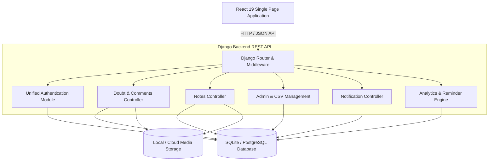
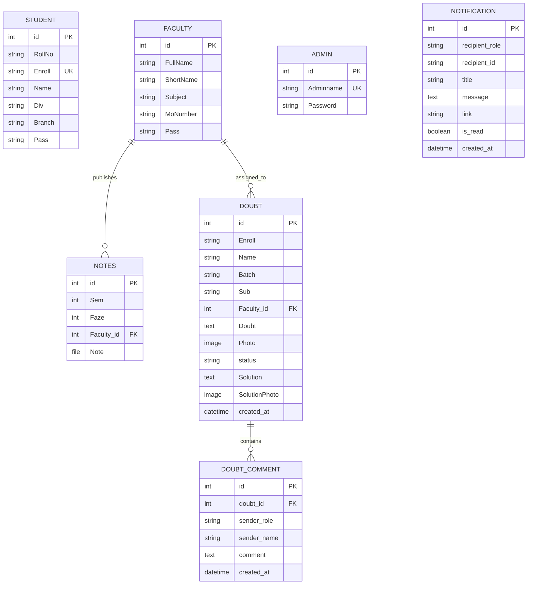

# 🚀 DoubtDesk — Academic Doubt Clearing & Learning Management Platform

[](https://www.djangoproject.com/)
[](https://react.dev/)
[](https://www.python.org/)
[](LICENSE)

**DoubtDesk** is a full-stack, enterprise-ready academic management and doubt-clearing platform designed for universities, colleges, and educational institutes. It bridges the communication gap between students, faculty members, and administration by providing real-time doubt resolution, study material distribution, automated notification workflows, and comprehensive institutional analytics.

---

## 📌 Table of Contents

- [✨ Key Features](#-key-features)
- [🏗️ System Architecture](#️-system-architecture)
- [🛠️ Tech Stack](#️-tech-stack)
- [📂 Directory Structure](#-directory-structure)
- [📊 Database Schema & ER Model](#-database-schema--er-model)
- [🚀 Installation & Setup Guide](#-installation--setup-guide)
  - [Prerequisites](#prerequisites)
  - [Backend Setup (Django)](#1-backend-setup-django)
  - [Frontend Setup (React)](#2-frontend-setup-react)
  - [Database Seeding](#3-database-seeding)
- [🔑 Demo & Seed Credentials](#-demo--seed-credentials)
- [📋 CSV Bulk Import Format](#-csv-bulk-import-format)
- [☁️ Render.com Deployment Guide](#️-rendercom-deployment-guide)
- [🤝 Contributing & License](#-contributing--license)

---

## ✨ Key Features

### 🎓 Student Portal
- **Submit Doubts**: Submit academic questions with subject tags, faculty selection, description, and optional image attachments.
- **Track Status**: Monitor doubt status in real-time (`Pending` vs `Solved`).
- **Interactive Solutions**: View comprehensive text and photo solutions posted by assigned faculty.
- **Threaded Doubt Comments**: Engage in real-time clarification discussions on specific doubt tickets.
- **Notes Repository**: Browse and download study notes categorized by Semester and Academic Phase (Faze).
- **Profile & Password Management**: View profile metadata and securely update passwords.

### 👨‍🏫 Faculty Portal
- **Doubt Management Dashboard**: Filter assigned doubts by status (`All`, `Pending`, `Solved`).
- **Solve Doubts**: Provide detailed text solutions and upload handwritten/diagram solution photos.
- **Study Notes Publishing**: Upload course notes categorized by Semester and Phase.
- **Threaded Clarifications**: Discuss doubt details with students via dedicated comment threads.
- **Analytics & Metrics**: View personal resolution stats, average resolution time, pending counts, and completion rates.

### 🛡️ Admin Management Portal
- **User Management**: Add, view, and remove Students and Faculty members individually.
- **Bulk CSV Import**: Import hundreds of student or faculty records instantly via CSV file upload.
- **Automated Overdue Reminders**: Send automated notifications to faculty members with pending or overdue doubts.
- **Institutional Analytics**: High-level reporting on institutional doubt volume, subject distribution, and faculty responsiveness.

### 🔔 Smart Notification Center
- **Role-Based Routing**: Instant notifications delivered to specific Students, Faculty, or Admins.
- **Unread Badges & Quick Actions**: Counter badge for new alerts, mark as read, or mark all as read.
- **Trigger Events**: Automatic alerts on doubt submission, solution posting, new comments, and admin reminders.

### 🔐 Unified Authentication Gateway
- **Single Login Portal**: Intelligently authenticates user credentials across Admin, Faculty, and Student databases automatically.
- **Password Hashing**: SHA256 hashed password storage for account security.

---

## 🏗️ System Architecture



---

## 🛠️ Tech Stack

### Frontend
- **Framework**: [React 19](https://react.dev/)
- **Routing**: [React Router DOM v7](https://reactrouter.com/)
- **HTTP Client**: [Axios](https://axios-http.com/)
- **Styling**: Vanilla CSS3 with Modern Variables, Flexbox/Grid Layouts, Glassmorphism, and Responsive Micro-animations

### Backend
- **Framework**: [Django 4.2 REST Framework](https://www.djangoproject.com/)
- **Language**: Python 3.10+
- **Image Processing**: [Pillow](https://python-pillow.org/)
- **File Upload handling**: Django Media File Storage Pipeline

### Database
- **Development**: SQLite3
- **Production Ready**: PostgreSQL / MySQL compatible via Django ORM

---

## 📂 Directory Structure

```text
DoubtDesk/
├── backend/
│   ├── backend/             # Django Project Configuration
│   │   ├── __init__.py
│   │   ├── asgi.py
│   │   ├── settings.py      # Core Settings & App Configuration
│   │   ├── urls.py          # Root URL Routing
│   │   └── wsgi.py
│   ├── Doubt/               # Core Application App
│   │   ├── admin.py         # Django Admin Registrations
│   │   ├── apps.py
│   │   ├── models.py        # Database Schema Models
│   │   ├── urls.py          # API Endpoint Mappings
│   │   └── views.py         # REST Views & Controller Logic
│   ├── media/               # Uploaded Notes, Doubts & Solution Images
│   ├── manage.py            # Django CLI Utility
│   ├── seed_db.py           # Core Seeding Script for Users
│   ├── seed_doubts.py       # Seeding Script for Demo Doubts
│   └── seed_notes.py        # Seeding Script for Sample Notes
├── frontend/
│   ├── public/              # Public Assets & Index HTML
│   ├── src/
│   │   ├── assets/          # Logos & Background Graphics
│   │   ├── components/      # Modular React Components & Views
│   │   │   ├── AdminLayout.js / .css
│   │   │   ├── FacultyLayout.js
│   │   │   ├── ProfileLayout.js
│   │   │   ├── Doubt.js / .css
│   │   │   ├── SolveDoubt.js
│   │   │   ├── DoubtComments.js / .css
│   │   │   ├── Notes.js / UploadNotes.js
│   │   │   ├── AddStudent.js / AddStudentCsv.js
│   │   │   ├── AddFaculty.js / AddFacultyCsv.js
│   │   │   ├── FacultyDoubtStats.js / .css
│   │   │   ├── NotificationBell.js / .css
│   │   │   └── ...
│   │   ├── api.js           # Centralized Axios Configuration
│   │   ├── App.js           # Main Application Routes & State
│   │   ├── index.css        # Global Design System & Variables
│   │   └── index.js         # React App Mounting Point
│   └── package.json         # Frontend Dependencies & Scripts
└── README.md                # System Documentation
```

---

## 📊 Database Schema & ER Model



---

## 🚀 Installation & Setup Guide

### Prerequisites
Make sure you have the following installed on your environment:
- **Python**: `3.10` or higher
- **Node.js**: `v16.x` or higher
- **npm**: `v8.x` or higher
- **Git**

---

### 1. Backend Setup (Django)

1. **Navigate to the backend directory**:
   ```bash
   cd backend
   ```

2. **Create and activate a virtual environment**:
   - *Windows (PowerShell)*:
     ```powershell
     python -m venv venv
     .\venv\Scripts\Activate
     ```
   - *Linux / macOS*:
     ```bash
     python3 -m venv venv
     source venv/bin/activate
     ```

3. **Install required Python dependencies**:
   ```bash
   pip install django django-cors-headers pillow requests
   ```

4. **Apply database migrations**:
   ```bash
   python manage.py makemigrations
   python manage.py migrate
   ```

5. **Start the Django Development Server**:
   ```bash
   python manage.py runserver
   ```
   The backend API will run live at `http://127.0.0.1:8000/`.

---

### 2. Frontend Setup (React)

1. **Open a new terminal and navigate to the frontend directory**:
   ```bash
   cd frontend
   ```

2. **Install JavaScript dependencies**:
   ```bash
   npm install
   ```

3. **Start the React Development Server**:
   ```bash
   npm start
   ```
   The frontend application will open automatically at `http://localhost:3000/`.

---

### 3. Database Seeding

To quickly populate the application with initial test accounts, sample notes, and doubt entries, run the provided seed scripts:

```bash
cd backend
python seed_db.py      # Creates initial Student, Faculty, and Admin accounts
python seed_notes.py   # Creates sample notes entries
python seed_doubts.py  # Creates demo doubts and solutions
```

---

## 🔑 Demo & Seed Credentials

You can log in to the application using any of the seeded accounts:

| Role | Username / Identifier | Password | Access Rights |
| :--- | :--- | :--- | :--- |
| **Admin** | `admin` | `1234` | Full management, CSV imports, Reminder dispatches, System Analytics |
| **Faculty** | `RKP` | `1234` | Solve assigned doubts, Upload/Manage notes, Respond to comments, View stats |
| **Student** | `24002170510023` | `123456` | Submit doubts, Download notes, View solutions, Comment on doubt tickets |

---

## 📡 API Documentation

### 🔐 Authentication Endpoints

| Endpoint | Method | Description | Request Body Parameters |
| :--- | :--- | :--- | :--- |
| `/api/login/` | `POST` | Unified Login (Auto-detects role) | `{ "username": "...", "password": "..." }` |
| `/api/login/student/` | `POST` | Direct Student Login | `{ "enroll": "...", "password": "..." }` |
| `/api/login/faculty/` | `POST` | Direct Faculty Login | `{ "shortname": "...", "password": "..." }` |
| `/api/login/admin/` | `POST` | Direct Admin Login | `{ "adminname": "...", "password": "..." }` |
| `/api/change-password/` | `POST` | Change User Password | `{ "role": "...", "user_id": "...", "old_password": "...", "new_password": "..." }` |
| `/api/logout/` | `POST` | User Session Logout | `{}` |

---

### ❓ Doubt Management Endpoints

| Endpoint | Method | Description |
| :--- | :--- | :--- |
| `/api/doubts/` | `GET` | Retrieve list of doubts (Filterable by `enroll`, `shortname`, `status`) |
| `/api/doubts/submit/` | `POST` | Submit a new student doubt with optional image upload |
| `/api/doubts/<id>/solve/` | `POST` | Post a solution for a doubt (Text solution + Solution photo) |
| `/api/doubts/<id>/status/` | `PATCH` | Update doubt status (`pending` / `solved`) |
| `/api/doubts/<id>/delete/` | `DELETE` | Delete a specific doubt entry |
| `/api/doubts/<id>/comments/` | `GET` / `POST` | Retrieve or post threaded discussion comments on a doubt |

---

### 📚 Study Notes Endpoints

| Endpoint | Method | Description |
| :--- | :--- | :--- |
| `/api/notes/` | `GET` | Fetch list of study notes (Filterable by `sem`, `faze`) |
| `/api/notes/upload/` | `POST` | Upload a new note file (Requires `sem`, `faze`, `faculty_id`, `file`) |
| `/api/notes/<id>/delete/` | `DELETE` | Delete an uploaded note entry |

---

### 🛡️ Admin & Analytics Endpoints

| Endpoint | Method | Description |
| :--- | :--- | :--- |
| `/api/admin/add-student/` | `POST` | Register a single new student |
| `/api/admin/add-student-csv/` | `POST` | Bulk register students via CSV upload |
| `/api/admin/delete-student/` | `POST` | Remove a student record |
| `/api/admin/add-faculty/` | `POST` | Register a single new faculty member |
| `/api/admin/add-faculty-csv/` | `POST` | Bulk register faculty members via CSV upload |
| `/api/admin/delete-faculty/` | `POST` | Remove a faculty record |
| `/api/admin/send-reminder/` | `POST` | Send overdue doubt reminders to faculty |
| `/api/analytics/` | `GET` | Overall institutional doubt analytics data |
| `/api/analytics/faculty-stats/` | `GET` | Detailed performance breakdown per faculty member |

---

### 🔔 Notification Endpoints

| Endpoint | Method | Description |
| :--- | :--- | :--- |
| `/api/notifications/` | `GET` | Fetch notifications for logged-in user (`role`, `id`) |
| `/api/notifications/<id>/read/` | `POST` | Mark specific notification as read |
| `/api/notifications/read-all/` | `POST` | Mark all notifications as read for current user |

---

## 📋 CSV Bulk Import Format

When importing Students or Faculty in bulk through the Admin Dashboard, ensure your CSV files follow the exact column headers below:

### 1. Student Import CSV (`students.csv`)
```csv
RollNo,Enroll,Name,Div,Branch,Pass
101,24002170510023,Lunagariya Hinav,A,Artificial Intelligence & Data Science,123456
102,24002170510024,Patel Aarav,B,Computer Engineering,123456
```

### 2. Faculty Import CSV (`faculty.csv`)
```csv
FullName,ShortName,Subject,MoNumber,Pass
Dr. R. K. Patel,RKP,Computer Engineering,+91 9876543210,1234
Prof. S. M. Shah,SMS,Data Structures,+91 9876543211,1234
---

## ☁️ Render.com Deployment Guide

This project includes pre-configured Render deployment configuration (`render.yaml`, `build.sh`, `Procfile`, `requirements.txt`, and `runtime.txt`).

### Option 1: 1-Click Render Blueprint Deployment (Recommended)
1. Push your repository to **GitHub / GitLab**.
2. Log in to [Render.com Dashboard](https://dashboard.render.com/).
3. Click **New +** -> **Blueprint**.
4. Connect your GitHub repository.
5. Render will automatically detect `render.yaml`, set up the **PostgreSQL Database** (`doubtdesk-db`), install Python & Node dependencies, build the React SPA, apply migrations, and deploy the unified web service.

### Option 2: Manual Web Service Deployment on Render
1. Create a **New Web Service** on Render.
2. Select repository and set runtime to **Python 3**.
3. Set **Build Command**: `./build.sh`
4. Set **Start Command**: `gunicorn --chdir backend backend.wsgi:application`
5. Add Environment Variables:
   - `PYTHON_VERSION` = `3.10.12`
   - `SECRET_KEY` = *(Generate a secure random string)*
   - `DEBUG` = `False`
   - `ALLOWED_HOSTS` = `*`
   - `DATABASE_URL` = *(Internal Connection String from Render PostgreSQL)*

---

## 🤝 Contributing & License

Contributions, feature requests, and improvements are welcome!

1. Fork the Project
2. Create your Feature Branch (`git checkout -b feature/AwesomeFeature`)
3. Commit your Changes (`git commit -m 'Add some AwesomeFeature'`)
4. Push to the Branch (`git push origin feature/AwesomeFeature`)
5. Open a Pull Request

Distributed under the **MIT License**. See `LICENSE` for more information.

---

<p center="align">
  <b>DoubtDesk</b> — Built with ❤️ for seamless institutional learning & academic excellence.
</p>
